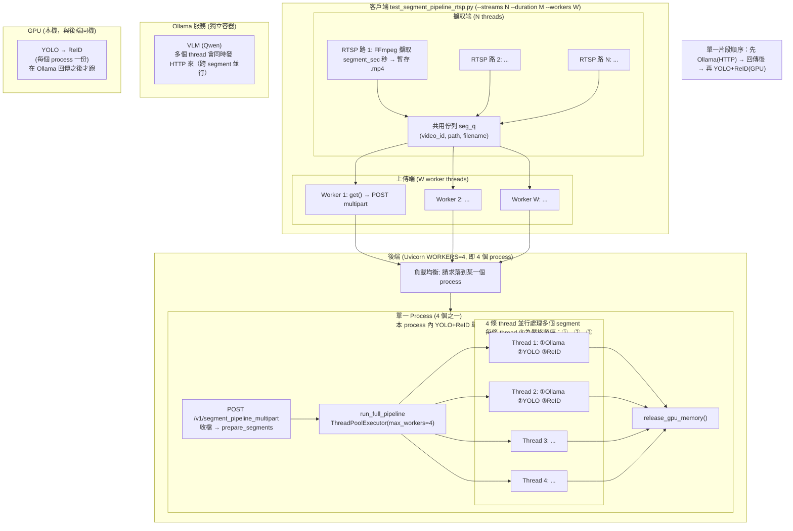
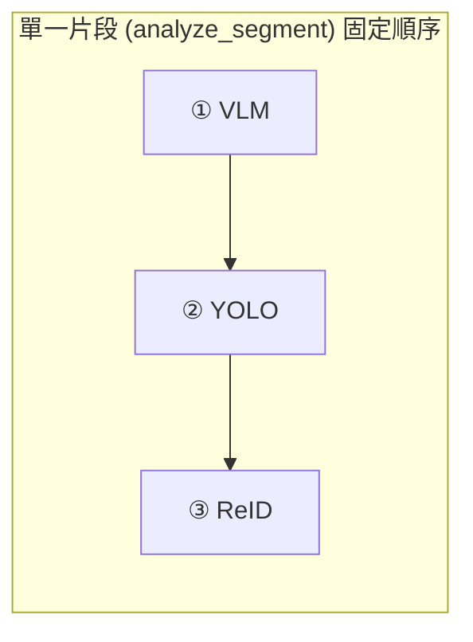
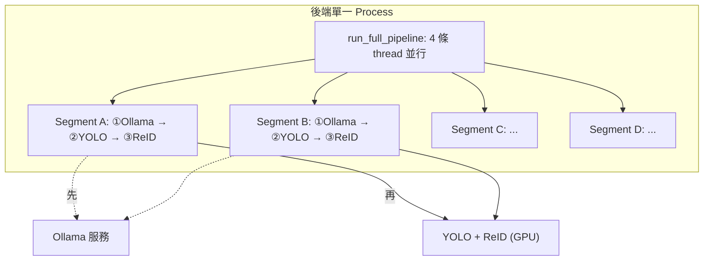
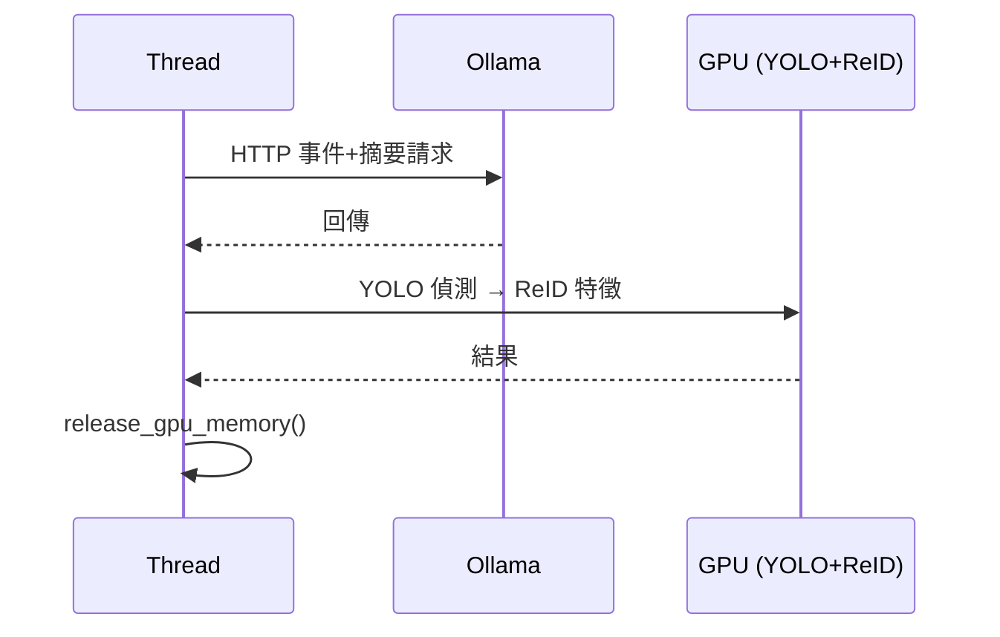

# RTSP 多路測試腳本與後端 API 流程說明（供流程圖使用）

## 一、角色與名詞

| 名詞 | 說明 |
|------|------|
| **WORKERS=4（後端）** | Uvicorn 開 4 個 **process**，每個 process 是獨立的 Python 進程，各載一份 YOLO + ReID 在 **GPU** 上常駐，對外一起聽同一個 port（例如 8080）。 |
| **Ollama** | 獨立服務（另一容器/進程），提供 VLM（如 Qwen）。後端多個 worker 可**同時**對 Ollama 發多個 HTTP 請求，由 Ollama 自己處理並行。 |
| **run_full_pipeline 的 worker_count=4** | 在**單一 API 請求**內，用 `ThreadPoolExecutor(max_workers=4)` 開 4 條 **thread**，並行處理**多個片段**；每條 thread 內部是**嚴格依序**：「VLM（Ollama）→ YOLO → ReID」。 |
| **test_segment_pipeline_rtsp.py 的 --workers** | **客戶端**同時發幾個 API 請求（幾個 thread 同時 POST `/v1/segment_pipeline_multipart`）。 |
| **--streams** | **客戶端**幾路 RTSP 擷取（幾條 thread 用 FFmpeg 擷取影片並把結果放進佇列）。 |

---

## 二、test_segment_pipeline_rtsp.py（客戶端）流程（多路長時間模式）

**觸發條件：** `--streams N --duration M`（N 路 RTSP，跑 M 分鐘）

1. **共用佇列**  
   - `seg_q`：每筆為 `(video_id, 本機暫存 .mp4 路徑, 檔名)`。

2. **擷取端（Producer）**  
   - 啟動 **num_streams** 條 thread（例如 `--streams 3` → 3 條）。  
   - 每條 thread 跑 `capture_loop(stream_index)`：  
     - 在 `end_time` 前重複：用 **FFmpeg** 從同一個 RTSP URL 擷取 **segment_sec** 秒（例如 10s）→ 寫入暫存 .mp4 → `seg_q.put((video_id, path, filename))`。  
   - 每路有獨立 `video_id`（RTSP_01, RTSP_02, …）。

3. **消費端（Consumer）**  
   - 啟動 **num_workers** 條 thread（例如 `--workers 3` → 3 條）。  
   - 每條 thread 跑 `worker()`：  
     - 從 `seg_q.get()` 取一筆；若是結束標記則離開。  
     - 否則：**POST 該 .mp4 到後端** `POST /v1/segment_pipeline_multipart`（含 model_type, qwen_model, segment_duration, yolo 參數等）。  
     - 紀錄開始/結束時間與成功與否，刪除本機暫存檔，`seg_q.task_done()`。  
   - **並行度**：同時最多 num_workers 個「上傳 + 後端整段 pipeline」在進行。

4. **結束**  
   - 等所有擷取 thread 結束 → 對每個 worker 放一個 SENTINEL → 等所有 worker thread 結束。  
   - 將每段處理時間寫入 `segment_timing_YYYYMMDD_HHMMSS.json`。

**注意：** 此腳本**沒有**呼叫後端的 `/v1/segment_pipeline_rtsp`，而是「本機 FFmpeg 擷取 RTSP → 上傳單一影片檔 → 呼叫 **/v1/segment_pipeline_multipart**」。

---

## 三、後端 API：segment_pipeline_multipart（本腳本實際呼叫的端點）

1. 收到 **POST /v1/segment_pipeline_multipart**（Form：file 或 video_url 或 video_id，以及 model_type, qwen_model, segment_duration, yolo 參數等）。
2. **單一 Uvicorn worker（process）** 處理此請求（4 個 process 之一被選到）。
3. **取得影片**：若為上傳檔 → 寫入暫存檔得到 `local_path`；若為 video_url → 下載到暫存；若為 video_id → 用已存在影片。
4. **VideoService.prepare_segments**：依 segment_duration、overlap 等把影片切成多個片段檔（例如 segment_000.mp4, segment_001.mp4, …），得到 `seg_files`、`stem`、`total_duration`。
5. **AnalysisService.run_full_pipeline**(seg_files, …)：
   - 使用 **ThreadPoolExecutor(max_workers=worker_count)**，預設 **worker_count=4**。
   - 每個 segment 交給一個 thread 執行 `process_one(seg_path, idx)` → 組一個 `Req` → **AnalysisService.analyze_segment(req)**。
   - **多個 segment 之間**並行（4 條 thread 同時跑）；**單一片段內**則嚴格依序：**① VLM（Ollama）→ ② YOLO（GPU）→ ③ ReID（GPU）**，YOLO 和 ReID 都接在 Ollama 後面。
6. **Ollama 並行**指的是：不同 thread（不同 segment）可能**同時**在等 Ollama 回傳，所以 Ollama 會收到多個 HTTP 請求並行處理；不是「Ollama 與 YOLO 並行」。
7. **YOLO + ReID**：同一 process 內單例、在 GPU；每條 thread 在**做完 VLM 之後**才做 YOLO，再做 ReID。
8. 收集所有 segment 的結果後：寫 JSON、若有 DB 則 `_save_results_to_postgres`，最後 **AnalysisService.release_gpu_memory()**（在 finally），回傳 JSON。

---

## 四、後端 API：segment_pipeline_rtsp（腳本未用，但邏輯類似）

1. 收到 **POST /v1/segment_pipeline_rtsp**（Form：rtsp_url, capture_duration, model_type, …）。
2. **VideoService.capture_rtsp_to_temp**：後端自己用 RTSP 擷取一段影片到暫存檔。
3. **VideoService.prepare_segments**：同上，切成多個片段。
4. **AnalysisService.run_full_pipeline**：與 multipart 相同，ThreadPoolExecutor(worker_count=4)，每個片段 analyze_segment（VLM + YOLO + ReID）。
5. 寫 JSON、寫 DB、release_gpu_memory、回傳。

---

## 五、analyze_segment（單一片段在單一 thread 內）

在一條 **run_full_pipeline 的 worker thread** 裡執行，**順序固定**：先 VLM，再 YOLO，再 ReID（YOLO 和 ReID 都接在 Ollama 後面）。

1. **階段 1 – VLM（Ollama）**  
   - 依 `model_type`（qwen / gemini / moondream）：  
     - **qwen**：`AnalysisService.infer_segment_qwen` → 內部對 **Ollama** 發 HTTP（事件偵測+摘要），**等回傳**。  
     - **gemini**：呼叫 Gemini API。  
     - **moondream**：本機 Moondream 模型。  
   - 結果寫入 `result["parsed"]`（frame_analysis, summary_independent）。  
   - **此階段結束後**才進入階段 2。

2. **階段 2 – YOLO（GPU）→ ReID（GPU）**  
   - **AnalysisService.infer_segment_yolo**：  
     - 讀取片段影片，依 `yolo_every_sec` 取樣幀；  
     - 用 **YOLO-World**（GPU）做偵測 → 裁剪 bbox → 存圖；  
     - 用 **ReID**（GPU）對 crop 做特徵 → 得到 reid_embedding。  
   - 結果寫入 `result["raw_detection"]["yolo"]`。

3. **結尾**  
   - 計算 `time_sec`，呼叫 **_release_gpu_memory()**（僅釋放該次推理的 GPU 暫存，不卸載模型），回傳 `result`。

---

## 六、流程圖（Mermaid，以 test_segment_pipeline_rtsp.py 為主）

**重要：** 單一片段內一定是「先 Ollama（VLM），做完再 YOLO，再做 ReID」的**序列**。圖中每個 thread 的方塊表示該 segment 的處理順序；Ollama 的「並行」是指**多個 segment（多條 thread）同時在打 Ollama**，不是 Ollama 與 YOLO 並行。

**單一片段 pipeline（同一條 thread 內固定順序）：**

**單一 segment 時序（同一條 thread）：**

---

## 七、簡化版流程（僅客戶端 + 後端一層）

適合只畫「腳本 → 後端」的概觀：

1. **客戶端**  
   - N 條擷取 thread → 不斷產出「一段 RTSP 擷取」→ 放入 **seg_q**。  
   - W 條 worker thread → 從 seg_q 取件 → **POST 單一影片** 到 **/v1/segment_pipeline_multipart**。

2. **後端**  
   - **4 個 Uvicorn process**（WORKERS=4），每個 process 內有 **YOLO+ReID 常駐 GPU**。  
   - 每個請求：收檔 → 切段 → **run_full_pipeline** 用 **4 條 thread** 並行處理各 segment。  
   - 每條 thread：**VLM（呼叫 Ollama，可並行）→ YOLO（GPU）→ ReID（GPU）** → 最後 **release_gpu_memory()**。  
   - **Ollama** 為獨立服務，可同時接受多個後端 worker 的 VLM 請求。

把上述「Ollama 並行 + YOLO+ReID 4 個 process」對應到流程圖中的方塊與箭頭，即可畫出你要的流程圖。
